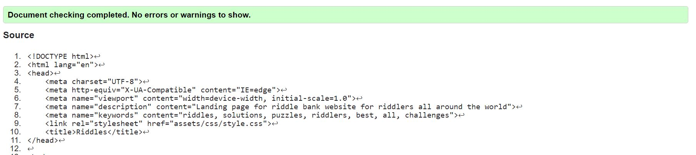

# HTML-CSS Essentials Project 1--riddlebank.com
##Introduction
I have always been a fan of riddles, so wanted to create a site which could be the starting point of a large bank into which users could submit their own favorite riddles, growing the bank past the small number of riddles I submitted originally.  

My objective in this project was to create a site in which one could read the question portion of a riddle, then reveal the solution portion in their own time after having tried to solve it. I also pushed to successfully implement several of the pieces we'd learned in the Code Institute to date, with particular emphasis on the HTML and CSS essentials sections.  

The live site can be found here:

<!-- ) -->

# Table of Contents

[1. User Experience](#ux) 

[   -User Goals](#user-goals) 
[   -User Expectations](#user-expectations) 
[   -Color scheme and font](#color-scheme) 
[   -Wire frames](#wireframes)

[2. Features](#features)

[3. Technologies used](#technologies-used)

[4. Bugs](#bugs)

[5. Deployment](#deployment)

[6. Credits](#credits)

## 1. User Experience

[Go to Table of Contents](#table-of-contents)

## 1.1 User Goals
The goal of this site is to provide enjoyable and challenging riddles to any who are interested in solving them, in a way that doesn't spoil the riddle by failing to hide the solution. 

## 1.2 User Expectations
--Site should be easy to navigate, separate pages should be clearly labeled and navigation between the three should be consistent and straightforward. 
--Layout of each individual page should make semantic sense. 
--General structure should remain the same across pages. Font, color scheme, header and footer style, etc.<br.>
--Text should be sensibly positioned on the page and easily legible. 
--The "add a riddle" process should be intuitively laid out and labeled, offering minimal obstacles to submitting the riddle. 
--Responsive design for all pages. 

## 1.3 Color Scheme
For reasons likely having to do with superheroes (or more accurately, supervillains), green and riddles often go hand in hand. All but two of the colors used came from a template for green shades and complimentary colors, from https://colors.dopely.top/inside-colors/green-color-palette-inspirations-with-names-hex-codes/.  

Colors Used: 
#01466f  Jade 
#3a3a3a  Dark Gray 
#75ce9f  Medium Aquamarine 
#ffc05e  Chardonnay 
Ghostwhite

## Wire Frames
In coordination with the mentor of this project, we used Balsamiq (https//balsamiq.com/) to create the wireframes for this project. Three wireframe pages were created, all in mobile view, and these were then used as guidelines for the project.

### Wireframe Screenshot

# 2. Features 

[Go to Table of Contents](#table-of-contents)

### Across entire site:
--Title of the site, riddlebank.com, is located in the same header at the top of the page for all 3 pages. 
--sans-serif font family is used.  After experimenting with some fonts I didn't find any I thought looked as clean.  
--Opacity of site header and all main page headers was edited to 80% make their appearance gentler.  
--Navigation bar is located in a header across the top of the page. Nav list elements were given a border-radius, hover and transition effect for improved aesthetic when the user moves to select them.  
--Gradient background added to header section containing nav bar. 
--hr elements with a solid border were used to divide sections of the page on all pages, specifically separating the nav bar from the content and then the content from the footer.  
--A footer element with social media links, located across a bottom section of the page, exists for all 3 pages. All 4 links (Facebook, Twitter, Instagram, Youtube) open in a new tab. 

### Home Page
--Background image of a black background with a chalk question mark stretches agross a large section of the top of the page, for most laptop sizes. Responsive design is used to replace this image with a dark gray background consistent with the color scheme for all device sizes 1024px and below. 
--Small description blurb is provided to inform the users of the goal of the site, give basic navigational instructions, and let them know they can add their own riddles. 
--About Us section and site description are pushed to the left side of the site, so they don't clash with the question mark which is located on the right side of the background image. For smaller device sizes, when there is no issue of text overlay on top of the background image, the About Us header and text description are centralized. 

The screenshot of the home page is below:

### Riddles Page
--Centralized header. 
--Small instructional p element added below header to inform users how to reveal solutions, be they on desktop, mobile, or tablet.  
--Dark gray border added around each individual riddle to help separate one riddle from the next.   
--Riddles initially have the same text color as their background, so they are invisible unless the pesudo class of .hover is triggered, in which case the text color changes to be visible on the green background. On mobile deivces, this classes is triggered with a click as opposed to a hover.   

The screenshot of the riddles page is below:

### Form Page
--Centralized header. 
--Dark gray border added around entirety of the form content. 
--Form input elements centralized and separated by br elements to make each input on its own line. This ensures that the form remains more responsive across device sizes.    
--Placeholder text added to username, riddle, and solution section to provide basic input instructions. 
--Large submit button provided at the end of the form, which takes you to a page validating form submission. 

The screenshot of the form page is below:

The screenshot of the validation message is below:

## 3. Technologies used
[Go to Table of Contents](#table-of-contents)

*HTML5--HTML5 was used for the structure of all 3 pages of the site. 
*CSS3--A single CSS3 page was referenced on all HTML pages and used to style all HTML elements. 
*balsamiq--Wireframes created via a balsamiq template were used to preview mobile versions of the site. 
*Font Awesome--Font awesome was used to import icons for the social media links. 
*Chrome--Chrome devtools were used to debug and test the site. 
*Github--Github was used to create the repository, and all commits were pushed through Github. 
*Gitpod--Gitpod was used as the main editor for the site. 
*W3C--The W3C Validation service was used to validate both the CSS and HTML pages. 

# 4. Bugs 
[Go to Table of Contents](#table-of-contents)

--There is a small green margin around the top and bottom of the footer.  The appearance is fine, but I don't know why it is there and it is not there by design. 
--There is a slight difference to the shades of opacity for the About Us header as opposed to all the other headers on which opacity was applied. 
--There is a mysterious border on the hero-hr element diving the nav bar from the hero image on the home page. There is also a less noticeable inconsistency in the color of the other hr elements used as dividers. 
--Links do not work in table of contents of README, although the link to return to the table of contents is functional.  

## 4.2 Validation
The W3C Validator Service was used to validate all HTML pages of my code. 

### Home Page Validation

The screenshot of the home page validation is below. No issues were found. 

### Riddles Page Validation

Some issues were found with the riddles page validation. Specifically, it pointed out a need for headers to describe different sections. For my purposes however, such headers would actually interfere with the struture of the page, so code was left as is. However it is worth noting tha tin the future I should probably use a different element than the section element. Screenshots are below.  

### Form Page Validation

One issues was resolved on the form page using the validator. I had an input with type="username" which should have been type="text".  Screenshots of the indication and ensuing completed check are below. Code was changed accordingly, after which the second screenshot was the result of validation. 

# 5. Deployment 
[Go to Table of Contents](#table-of-contents)

This site was deployed to Github pages, on which a link was generated with a live version of the website. This link is below: 

# 6. Credits 
[Go to Table of Contents](#table-of-contents)

### Code
Code on lines 368-370 and 381-383 were taken from google searches on the subject of placeholder text.  Credit to https://stackoverflow.com/questions/47357063/vertically-align-an-input-placeholder-with-css-or-set-line-height?noredirect=1&lq=1

Header content closely follows the header laid out in the Code Institute Lesson "Creating your first gitpod project. Credit to https://codeinstitute.net/se/

Footer content closely follows and is copied from the footer created in the Love Running project, which was a quasi-project lesson designed to help us learn the basics of creating a website, completed just before starting this project. Credit to https://codeinstitute.net/se/

Background gradient for nav bar taken from https://cssgradient.io/

Overall complemenetary color scheme taken from https://colors.dopely.top/inside-colors/green-color-palette-inspirations-with-names-hex-codes/

Overall layout, structure, and some wording of README.md document came from using https://raw.githubusercontent.com/dhakal79/Portfolio-project-MS1/master/README.md as a template. I had been recommended to follow this structure from a mentor and it was invaluable.  

### Content
All riddles were input from me from memory. However, I should credit the J.R.R. Tolkien for riddles 1 and 4, as I know I was remembering them from his book, The Hobbit. 